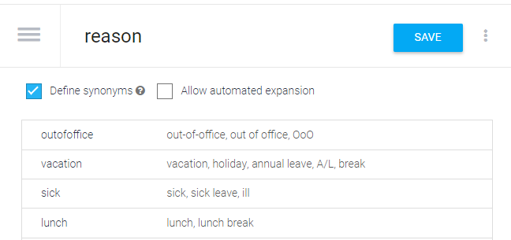
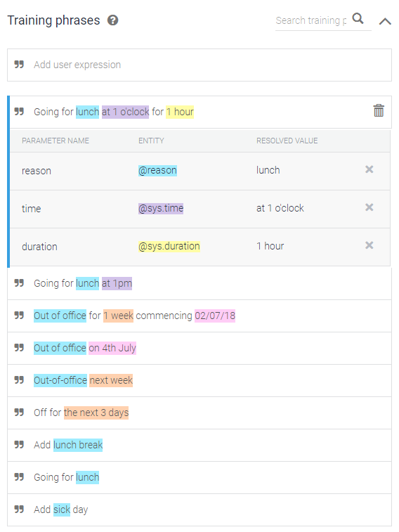
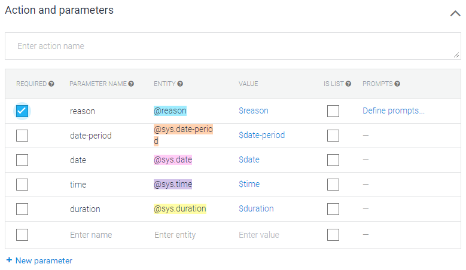
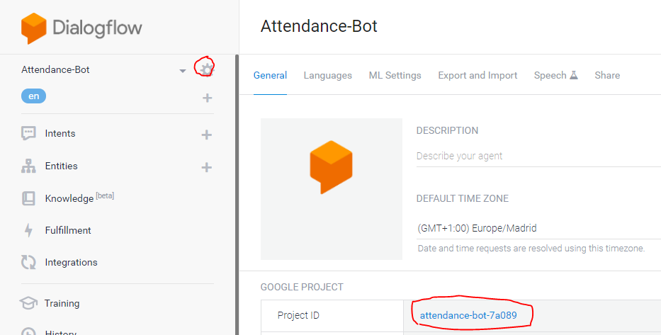
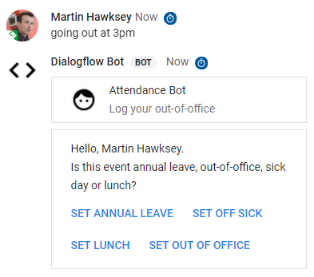
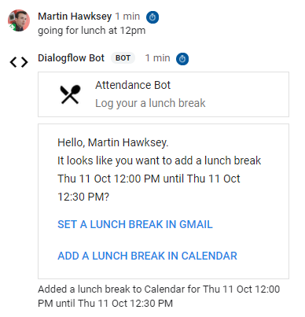

# Hangouts-Chat-bot-with-Dialogflow
In this blog post I’m going to show you how you can use Google Dialogflow in your Google Hangouts Chat bots created with Google Apps Script. Dialogflow, formerly api.ai, is a tool for for building conversational interfaces. I’m assuming you have already started creating Hangouts Chat bots. As part of this you would have started to work out how to respond to text message events from your bot. The [`messages`](https://developers.google.com/hangouts/chat/reference/rest/v1/spaces.messages#Message) object contains lots of useful information about the sender, space, thread and so on, but interpreting the intent of the text message can be challenging. 

For example, in the [Hangouts Chat bot with Apps Script codelab](https://codelabs.developers.google.com/codelabs/chat-apps-script/) where you create a bot to work out if the user wants to record a holiday or sick day in their calendar .indexOf() is used to detect a keyword:

 ```
  // If the user said that they were 'sick', adjust the image in the
  // header sent in response.
  if (userMessage.indexOf('sick') > -1) {
    // Hospital material icon
    HEADER.header.imageUrl = 'https://goo.gl/mnZ37b';
    reason = REASON.SICK;
  } else if (userMessage.indexOf('vacation') > -1) {
    // Spa material icon
    HEADER.header.imageUrl = 'https://goo.gl/EbgHuc';
  } 
```

In this example if the message text had ‘holiday’ instead of ‘vacation’ the user’s intent would be lost. You could of course start adding further conditions or regular expression matching, but with Dialogflow there is an opportunity to apply a little AI and come up with a more scalable solution.

To show you the basics of Dialogflow in Google Apps Script I’ll extend the Hangouts Chat bot codelab to extract and use the intent of the user’s message. As part of this I’ll show how you can extract information from a message like when an event should occur and duration. All of this will also be wrapped in a conversational interface, so if the user forgets to include some information they will be prompted to provide more details.

***Table of Contents***
  * [What you will learn](#what-you-will-learn)
  * [What you'll need](#what-you-ll-need)
  * [Getting the sample code](#getting-the-sample-code)
    + [Cloning the GitHub repository](#cloning-the-github-repository)
  * [Setting up our Dialogflow agent](#setting-up-our-dialogflow-agent)
    + [Create and setup a new **Entity** for `reason`](#create-and-setup-a-new-entity-for--reason-)
    + [Create an **Intents** called attendance and add some **Training Phrases**](#create-an---intents---called-attendance-and-add-some---training-phrases--)
    + [Make reason a required parameter](#make-reason-a-required-parameter)
  * [Setting up Google Apps Script for interaction with Dialogflow](#setting-up-google-apps-script-for-interaction-with-dialogflow)
  * [Using Dialogflow to respond to message events](#using-dialogflow-to-respond-to-message-events)
  * [Summary](#summary)

## What you will learn

* How to setup a basic Dialogflow Agent

* How to setup a Google Apps Script project to interact with a Dialogflow Agent

* How to handle responses from a Dialogflow Agent in Google Apps Script

## What you'll need

* Access to the internet and a web browser.

* A G Suite account.

* Basic JavaScript skills—Google Apps Script only supports JavaScript.

> **Note:** While you must use a G Suite account to interact with the Hangouts Chat bot if you are interested in creating and using a Dialogflow Agent in your Apps Script project for other purposes you can also use a @gmail.com account.

## Getting the sample code

The final code for this project including a zip of the Dialogflow agent can either be cloned or downloaded from the following GitHub repository. 

Click the following link to download all the code used in this post:

[Download source code](https://github.com/mhawksey/Hangouts-Chat-bot-with-Dialogflow/archive/master.zip)

### Cloning the GitHub repository

To clone the GitHub repository for this codelab, run the following command:

`git clone https://github.com/mhawksey/Hangouts-Chat-bot-with-Dialogflow.git`

## Setting up our Dialogflow agent

Dialogflow have a [build your first agent guide](https://dialogflow.com/docs/getting-started), which will get you setup with an account (there is a free standard edition you can use). After you have created your agent, I called mine ‘Attendance-Bot’, I recommend the following steps:

> If you want to skip these steps [download the .zip in the code sample](https://github.com/mhawksey/Hangouts-Chat-bot-with-Dialogflow/blob/master/assets/Attendance-Bot.zip) and imported to your Dialogflow agent.

1. Create and setup a new **Entity** for reason

2. Create an **Intents** called attendance and add some **Training Phrases**

3. Make the reason a required parameter


### Create and setup a new **Entity** for `reason`

From the **Entity** menu on the left hand side create a new entity called `reason` and added the reference values `vacation`, `sick`, `lunch`, and `outofoffice`. For each reference value you can add synonyms which allows our agent to interpret alternative ways of saying things like vacation:  



### Create an **Intents** called attendance and add some **Training Phrases**

From the  **Intents** menu on the left hand side create a new intent called `attendance` and start adding some **Training Phrases**:



As you add training phrases Dialogflow will start identify and highlight built-in entities like time, date and duration as well as the custom reason entity we created in the previous step. 

### Make reason a required parameter

Once you have some phrases a list of **Action and parameters** is automatically created. In this example we want to make sure reason is identified as a required parameter:



Setting reason as a required parameter allows us to define some prompts if the reason for the absence is not included in the initial message to our bot. You can continue to refine the phrases and prompts you use. 

The next steps will show you how to setup your Google Apps Script project to interact with your agent.

## Setting up Google Apps Script for interaction with Dialogflow

To use your Dialogflow agent in your Apps Script project there is some setup required. The steps below can be used for any Apps Script project that you want to interact with a Dialogflow agent. If you are wanting to use Dialogflow as a continuation to the  [Hangouts Chat bot with Apps Script codelab](https://codelabs.developers.google.com/codelabs/chat-apps-script/) you should complete the steps below in your existing apps script project. 

To use the Dialogflow API I’ll be using two client libraries:

* [cGoa](http://ramblings.mcpher.com/Home/excelquirks/goa) – library developed by Bruce Mcpherson to handle OAuth 2 calls

* Dataflow – a library I’ve created for Dialogflow API calls (generated from the Google Discovery Service with the [Generator-SRC](https://github.com/Spencer-Easton/Apps-Script-GoogleApis-Libraries/tree/master/Generator-SRC) script created by Spencer Easton – [read about it](https://plus.google.com/u/0/+SpencerEastonCCS/posts/hrQ9eaHMUW6))

Note: These instructions are designed for V2 of the Dialogflow API which requires you to use a Service Account: 

1. Follow the Dialogflow documentation on [Getting the Service Account key](https://dialogflow.com/docs/reference/v2-auth-setup#getting_the_service_account_key) (**Important:** when adding **Roles** to your service account you need to add at least **Dialogflow API Client** to allow interaction with the intent endpoint). 

2. Upload your have downloaded your JSON key file to Google Drive (this will be temporary while we configure the OAuth 2 setup). 

3. In your script project  click on **Resources > Libraries…** and in the ‘Add a library’ field add the following libraries selecting the latest version:

    1. `MZx5DzNPsYjVyZaR67xXJQai_d-phDA33` – cGoa

    2. `1G621Wm91ATQwuKtETmIr0H39UeqSXEBofL7m2AXwEkm3UypYmOuWKdCx` – Dialogflow

4. In your script project add the following code replacing `NAME_OF_YOUR_JSON_KEY_FILE` with the name of the file uploaded to Drive in step 2:
```
function oneOffSetting() { 
  var file = DriveApp.getFilesByName('NAME_OF_YOUR_JSON_KEY_FILE.json').next();
  // used by all using this script
  var propertyStore = PropertiesService.getScriptProperties();
  // service account for our Dialogflow agent
  cGoa.GoaApp.setPackage (propertyStore , 
    cGoa.GoaApp.createServiceAccount (DriveApp , {
      packageName: 'dialogflow_serviceaccount',
      fileId: file.getId(),
      scopes : cGoa.GoaApp.scopesGoogleExpand (['cloud-platform']),
      service:'google_service'
    }));
}
```

5. In the script editor run `oneOffSetting()`. Once the function has executed you can delete the function and the JSON file from Google Drive 

At this point  your Google Apps Script project is ready to make calls to your Dialogflow agent. To use the Dialogflow client library we need to get our access token which is set with `.setTokenService()`. The following code demonstrates how you can prepare a [`.projectsAgentSessionsDetectIntent()`](https://cloud.google.com/dialogflow-enterprise/docs/reference/rest/v2/projects.agent.sessions/detectIntent) call by passing a [`TextInput`](https://cloud.google.com/dialogflow-enterprise/docs/reference/rest/v2/projects.agent.sessions/detectIntent#textinput) as part of a [`queryInput`](https://cloud.google.com/dialogflow-enterprise/docs/reference/rest/v2/projects.agent.sessions/detectIntent#QueryInput) request object:

> **Note**: In the code below you need to replace `YOUR_DIALOGFLOW_PROJECT_ID` with the your Dialogflow Project ID found by clicking the setting cog in the Dialogflow console window:


```
/**
 * Detect message intent from Dialogflow Agent.
 * @param {String} message to find intent
 * @param {String} optLang optional language code
 * @return {object} JSON-formatted response
 */
function detectMessageIntent(message, optLang){
  // setting up calls to Dialogflow with Goa
  var goa = cGoa.GoaApp.createGoa ('dialogflow_serviceaccount',
                                   PropertiesService.getScriptProperties()).execute ();
  if (!goa.hasToken()) {
    throw 'something went wrong with goa - no token for calls';
  }
  // set our token 
  Dialogflow.setTokenService(function(){ return goa.getToken(); } );
  
  /* Preparing the Dialogflow.projects.agent.sessions.detectIntent call 
   * https://cloud.google.com/dialogflow-enterprise/docs/reference/rest/v2/projects.agent.sessions/detectIntent
   *
   * Building a queryInput request object https://cloud.google.com/dialogflow-enterprise/docs/reference/rest/v2/projects.agent.sessions/detectIntent#QueryInput
   * with a TextInput https://cloud.google.com/dialogflow-enterprise/docs/reference/rest/v2/projects.agent.sessions/detectIntent#textinput
  */
  var requestResource = {
    "queryInput": {
      "text": {
        "text": message,
        "languageCode": optLang || "en"
      }
    },

    "queryParams": {

      "timeZone": Session.getScriptTimeZone() // using script timezone but you may want to handle as a user setting

    }
  };

 /* Dialogflow.projectsAgentSessionsDetectIntent 
  * @param {string} session Required. The name of the session this query is sent to. Format:`projects/<Project ID>/agent/sessions/<Session ID>`.
  * up to the APIcaller to choose an appropriate session ID. It can be a random number orsome type of user identifier (preferably hashed)
  * In this example I'm using for the <Session ID>
  */
  // your Dialogflow project ID
  var PROJECT_ID = 'YOUR_DIALOGFLOW_PROJECT_ID'; // <- your Dialogflow proejct ID
  
  // using an URI encoded ActiveUserKey (non identifiable) https://developers.google.com/apps-script/reference/base/session#getTemporaryActiveUserKey()
  var SESSION_ID = encodeURIComponent(Session.getTemporaryActiveUserKey()); 
  
  var session = 'projects/'+PROJECT_ID+'/agent/sessions/'+SESSION_ID; // 
  var options = {};
  var intent = Dialogflow.projectsAgentSessionsDetectIntent(session, requestResource, options);
  return intent;
}
```
## Using Dialogflow to respond to message events

The following code can be used in your [Hangouts Chat bot with Apps Script codelab](https://codelabs.developers.google.com/codelabs/chat-apps-script/) instead of the existing `REASON` and `onMessage` function. As part of this the  `REASON` object has been extended to include text variations and icons. In the `onMessage` the users message is sent to the Dialogflow agent by calling `detectMessageIntent(userMessage)`  and the detected entity parameter values are returned. If a reason is detected this is used to create the widget for setting events in Gmail and Calendar. As part of this the detected entity parameters are stored in the widget `textButton.onClick.action.parameters` for use later. If no reason is detected by the Dialogflow agent a set of buttons are displayed to the user to select an option. For each button any entity parameters detected by the Dialogflow agent are also included for use later:


```
// new REASON object that has options for text title, inline text and icons 
var REASON = {
  'vacation': {title: 'Annual leave', inlineText: 'annual leave', imageUrl:  'https://goo.gl/EbgHuc' }, // Spa material icon
  'sick': {title: 'Off sick', inlineText: 'sick leave', imageUrl: 'https://goo.gl/mnZ37b'}, // Hospital material icon
  'lunch': {title: 'Lunch', inlineText: 'a lunch break', imageUrl: 'https://goo.gl/zEhek7'}, // Dining material icon
  'outofoffice': {title: 'Out of office', inlineText: 'an out-of-office', imageUrl: 'https://goo.gl/aXtqPZ'} // Event busy material icon 
};

/**
 * Responds to a MESSAGE event triggered in Hangouts Chat.
 * @param {object} event the event object from Hangouts Chat
 * @return {object} JSON-formatted response
 */
function onMessage(event) {
  console.info(event);
  var name = event.user.displayName;
  var userMessage = event.message.text;

  // detect intent of the message
  var intent = detectMessageIntent(userMessage);
  var intentParams = intent.queryResult.parameters;
  
  // if we have a reason show the Calendar and Gmail Out-of-Office buttons 
  if (intentParams.reason) {
    var reason = intentParams.reason;
    var widgets = createAddSetWidget(name, reason, intentParams);
  } else {
    // no reason detected so prompt user to select using agent prompt
    var fulfillmentMessages = intent.queryResult.fulfillmentMessages[0].text.text[0];
    // build a set of buttons based on REASON
    var reasonButtonObject = Object.keys(REASON).map(function (idx) {
      intentParams.reason = idx;
      return {
        textButton: {
          text: 'Set ' + REASON[idx].title,
          onClick: {
            action: {
              actionMethodName: 'reasonButtons',
              parameters: [{key: 'entities', value: JSON.stringify(intentParams)}]
            }
          }
        }
      }
    });
    var widgets = [{
      textParagraph: {
        text: 'Hello, ' + name + '.<br/>' + fulfillmentMessages
      }
    }, {
      buttons: reasonButtonObject
    }];
  }
  return createCardResponse(widgets);
}
/**
 * Create a card for setting events in Gmail or Calendar.
 * @param {string} name of the person adding the event
 * @param {string} reason of the event
 * @param {object} intentParams that contain any Dialogflow detected entities
 * @return {object} JSON-formatted response
 */
function createAddSetWidget(name, reason, intentParams) {
  // adjust the image and card subtitle based on reason
  HEADER.header.imageUrl = REASON[reason].imageUrl;
  HEADER.header.subtitle = 'Log your ' + REASON[reason].inlineText;
  
  // extract date objects from intent parameters returned by Dialogflow agent
  var dates = calcDateObject(intentParams);
  
  // build the Gmail/Calendar widget
  var widgets = [{
    textParagraph: {
      text: 'Hello, ' + name + '.<br/>It looks like you want to add ' + REASON[reason].inlineText + ' ' + dateRangeToString(dates) + '?'
    }
  }, {
    buttons: [{
      textButton: {
        text: 'Set ' + REASON[reason].inlineText + ' in Gmail',
        onClick: {
          action: {
            actionMethodName: 'turnOnAutoResponder',
            parameters: [{key: 'entities', value: JSON.stringify(intentParams)}]
          }
        }
      }
    }, {
      textButton: {
        text: 'Add ' + REASON[reason].inlineText + ' in Calendar',
        onClick: {
          action: {
            actionMethodName: 'blockOutCalendar',
            parameters: [{key: 'entities', value: JSON.stringify(intentParams)}]
          }
        }
      }
    }]
  }];
  return widgets;
}
```
There are also some modifications to the `CARD_CLICKED` event to handle the reason buttons and to pass in any entity parameters from the original user message.  
```
/**
 * Responds to a CARD_CLICKED event triggered in Hangouts Chat.
 * @param {object} event the event object from Hangouts Chat
 * @return {object} JSON-formatted response
 * @see https://developers.google.com/hangouts/chat/reference/message-formats/events
 */
function onCardClick(event) {
  console.info(event);
  var intentParams = JSON.parse(event.action.parameters[0].value)
  var message = "I'm sorry; I'm not sure which button you clicked.";
  if (event.action.actionMethodName == 'turnOnAutoResponder') {
    return { text: turnOnAutoResponder(intentParams)};
  } else if (event.action.actionMethodName == 'blockOutCalendar') {
    return { text: blockOutCalendar(intentParams)};
  } else if (event.action.actionMethodName == 'reasonButtons') {
    // now we know the reason we can show the Gmail/Calendar card which includes existing parameters
    // returned from the Dialogflow agent
    var widgets = createAddSetWidget(event.user.displayName, intentParams.reason, intentParams);
    return createCardResponse(widgets);
  }
  return { text: message };
}
```  

The script also includes some changes to the `turnOnAutoResponder()` and `blockOutCalendar()` functions to enable the dates/times identified by the Dialogflow agent to be used when creating events or Gmail out-of-office settings:  

```
/**
 * Turns on the user's vacation response for today in Gmail.
 * @param {object} intentParams detected by Dialogflow agent
 * @return {string} message
 */
function turnOnAutoResponder(intentParams) {
  var dates = calcDateObject(intentParams);
  var title = REASON[intentParams.reason].title;
  var inlineText = REASON[intentParams.reason].inlineText;
  Gmail.Users.Settings.updateVacation({
    enableAutoReply: true,
    responseSubject: title,
    responseBodyHtml: "I'm on " + inlineText + " between " + dateRangeToString(dates) + ".<br><br><i>Created by Attendance Bot!</i>",
    restrictToContacts: true,
    restrictToDomain: true,
    startTime: dates.startDate.getTime(),
    endTime: dates.endDate.getTime()
  }, 'me');
  var message = "Added " + inlineText + " to Gmail for " + dateRangeToString(dates);
  return message;
}

/**
 * Places an all-day meeting on the user's Calendar.
 * @param {object} intentParams detected by Dialogflow agent
 * @return {string} message
 */
function blockOutCalendar(intentParams) {
  var dates = calcDateObject(intentParams);
  var title = REASON[intentParams.reason].title;
  var inlineText = REASON[intentParams.reason].inlineText;
  var options = {description:"I'm  on " + inlineText + " between " + dateRangeToString(dates) + ".<br><br><i>Created by Attendance Bot!</i>"};
  if (intentParams.reason == 'lunch' || intentParams.reason == 'outofoffice'){
    CalendarApp.createEvent(title, dates.startDate, dates.endDate, options);
  } else {
    CalendarApp.createAllDayEvent(title, dates.startDate, dates.endDate, options);
  }
  var message = "Added " + inlineText + " to Calendar for " + dateRangeToString(dates);
  return message;
}
```
A challenge with working with Dialogflow agents that can detect different date/time entities  including durations and periods is calculating the actual start and end date. For example a phrase like ‘Going for lunch at 1pm for 1 hour’ in my agent has the following parameter values:

<table width="100%">
  <tr>
    <td>PARAMETER</td>
    <td>VALUE</td>
  </tr>
  <tr>
    <td>reason</td>
    <td>lunch</td>
  </tr>
  <tr>
    <td>time</td>
    <td>2018-10-06T13:00:00+01:00</td>
  </tr>
  <tr>
    <td>date-period</td>
    <td></td>
  </tr>
  <tr>
    <td>date</td>
    <td></td>
  </tr>
  <tr>
    <td>duration</td>
    <td>{"unit":"h","amount":1}</td>
  </tr>
</table>


Using a slightly different phrase ‘Going for lunch from 1pm until 2pm’ ***can*** return:

<table width="100%">
  <tr>
    <td>PARAMETER</td>
    <td>VALUE</td>
  </tr>
  <tr>
    <td>reason</td>
    <td>lunch</td>
  </tr>
  <tr>
    <td>time</td>
    <td></td>
  </tr>
  <tr>
    <td>date</td>
    <td></td>
  </tr>
  <tr>
    <td>time-period</td>
    <td>{"endTime":"2018-10-06T14:00:00+01:00","startTime":"2018-10-06T13:00:00+01:00"}</td>
  </tr>
  <tr>
    <td>duration</td>
    <td></td>
  </tr>
  <tr>
    <td>date-period</td>
    <td></td>
  </tr>
</table>


I say ‘can’ because the magic of Dialogflow is as you provide more training phrases it gets better at detecting entity parameters when phrased differently. To convert  the returned entity parameters I used the following:

```
var ONE_DAY_MILLIS = 24 * 60 * 60 * 1000;
/**
 * Returns a reformatted object array.
 * @param {object} entities returned by Dialogflow agent
 * @return {object} of calculated dates
 */
function calcDateObject(entities){
  var dates = {};
  // easy one - entities for date period
  if (entities['date-period']){
    dates.startDate = new Date(entities['date-period'].startDate);
    dates.endDate = new Date(entities['date-period'].endDate);
    return dates;
  } 
  // if no date period construct one
  if (entities['date']){
    dates.startDate = new Date(entities['date']);
  } else {
    dates.startDate = new Date();
  }
  if (entities['time']){
    var time = new Date(entities['time']); 
  } else {
    var time = new Date();
  }
  dates.startDate.setHours(time.getHours(), time.getMinutes()); 
  
  if (entities['reason'] == 'sick'){
    // if sick default to day
    dates.endDate = new Date(dates.startDate.getTime() + ONE_DAY_MILLIS);
  } else {
    // default to 30 mins
    dates.endDate = new Date(dates.startDate.getTime() + 30*60000);
  }
  if (entities['duration']){
    switch (entities['duration'].unit){
      case 'mo':
        dates.endDate = new Date(new Date().setMonth(dates.startDate.getMonth()+entities['duration'].amount));
        break;
      case 'wk':
        dates.endDate = new Date(dates.startDate.getTime() + entities['duration'].amount*7*ONE_DAY_MILLIS);
        break;
      case 'day':
        dates.endDate = new Date(dates.startDate.getTime() + entities['duration'].amount*ONE_DAY_MILLIS);
        break;
      case 'h':
        dates.endDate = new Date(dates.startDate.getTime() + entities['duration'].amount*60*60000);
        break;
      case 'm':
        dates.endDate = new Date(dates.startDate.getTime() + entities['duration'].amount*60000);
        break;
      default:
        throw "Can't handle duration";
        break;
    }
  }
  return dates;
}
```
Finally a function to convert the entities object back from the button parameters and to provide a formatted text response e.g. *It looks like you want to add a lunch break Tue 9 Oct 12:00 PM until Tue 9 Oct 12:30 PM?*
```
/**
 * Returns a date range string.
 * @param {object} dates to turn into human readable format
 * @return {string} of date range
 */
function dateRangeToString(dates){
  var tz = Session.getScriptTimeZone();
  var format = "EEE d MMM h:mm a";
  return Utilities.formatDate(dates.startDate, tz, format) + " until "+ 
         Utilities.formatDate(dates.endDate, tz, format);

}
```
That should be all the extra code you need and if you’re bot is deployed on the HEAD when you save your code it should be ready for testing. If you are having problems a reminder that the complete project is [available on Github](https://github.com/mhawksey/Hangouts-Chat-bot-with-Dialogflow/) and instructions on deployment are in [the codelab](https://codelabs.developers.google.com/codelabs/chat-apps-script/). When you test your bot the response cards will look slightly different to the codelab:



## Summary

Hopefully this post has helped you to get started with Dialogflow in Google Apps Script projects. Whilst I’ve focused on Google Hangouts Chat bot integration there is nothing stopping you from using conversational interfaces in your other projects. In this post I’ve only focused on the [`detectIntent`](https://cloud.google.com/dialogflow-enterprise/docs/reference/rest/v2/projects.agent.sessions/detectIntent#textinput) endpoint but there the other API methods you might want to use. For example, you could use Google Sheets/Forms as a way of collecting data to create new intents for your Dialogflow agent (see [`projects.agent.intents.create`](https://cloud.google.com/dialogflow-enterprise/docs/reference/rest/v2/projects.agent.intents/create)). 

If developing Dialogflow agents further in Apps Script you might want to consider how your projects are structured. In this example I’ve kept two seperate Cloud Console projects, one associated with the Dialogflow project and the other with the Apps Script project. For better maintenance you might want to consider moving the Apps Script console project into the Dialogflow console project (see [Switch to a different Google Cloud Platform project](https://developers.google.com/apps-script/guides/cloud-platform-projects#switch_to_a_different_google_cloud_platform_project)).

One final tip before developing Dialogflow agents is to also check out the Hangouts Chat  [design guidelines](https://developers.google.com/hangouts/chat/concepts/ux ) prepared by Google which provide tips on creating bots with the user experience in mind.
